---
title       : Introducing 'CrimeMap'
subtitle    : Using R, Shiny and ShinyApps for Quick Web App Development
author      : Jo-fai Chow (University of Exeter & XP Solutions)
job         : Final Year EngD Candidate in Hydroinformatics (Water + Machine Learning)
logo        : logo_LondonR_date.png
biglogo     : logo_LondonR_date.png
license     : by-nc-sa
framework   : io2012        # {io2012, html5slides, shower, dzslides, ...}
widgets     : []            # {mathjax, bootstrap, quiz}
mode        : selfcontained
hitheme     : tomorrow      # {tomorrow, tomorrow_night, solarized_dark, solarized_light}
highlighter : highlight.js  # {highlight.js, prettify, highlight}


--- &twocol w1:56% w2:44% .new-background
## Agenda

*** =left
<h4><br></h4>
1. <h9>Why R?</h9>
2. <h9>Introducing 'CrimeMap'</h9>
3. <h9>What's Next?</h9>
4. <h9>Beyond Data and Maps</h9>
5. <h9>Conclusions</h9>
6. <h9>Q & A</h9>

*** =right
<center></center>
<br>
<center>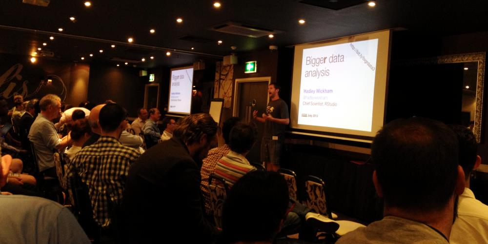</center>
<br>
<center><h4>Above: <b>Hadley Wickham's</b> LondonR talk on <b>dplyr</b> and <b>ggvis</b> back in July 2013 (my first ever LondonR experience).</h4></center>


--- .dark .segue .nobackground
## Why  ?


--- .new-background
## What People Think I Do
<center></center>


--- .new-background
## What People Think I Do
  <center>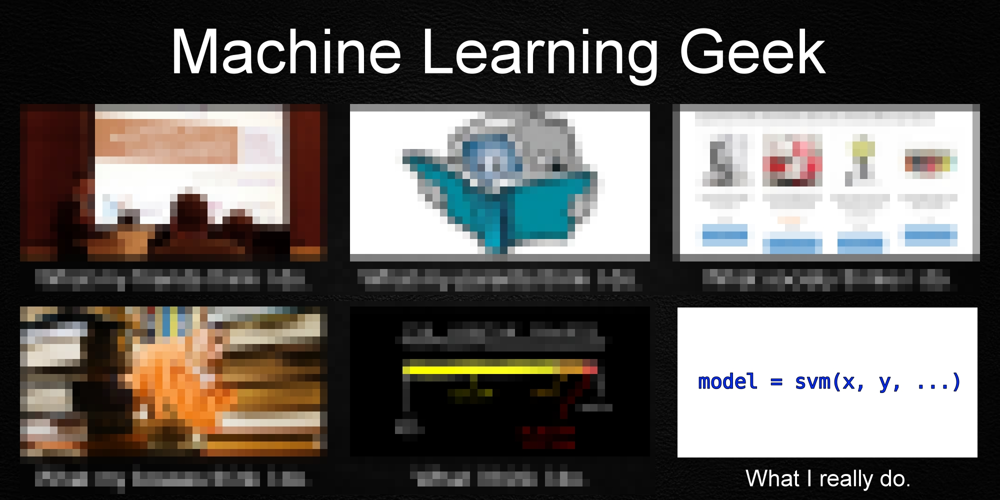</center>


--- &twocol w1:30% w2:65% .r-can-do-that
## R Can Do That ?

*** =left
<center></center>

<center><h9> ... and more !?</h9></center>

<center><h3>Thanks to Tal Galili's</h3></center>
<center></center>

*** =right


--- &twocol w1:48% w2:48% .new-background
## Taking My Leap of Faith (Jan - Mar 2013)

*** =left
<br>
<h9>Data Analysis (Coursera)</h9>

* <h3>MOOC by Jeff Leek</h3>
* <h3>Practical data analysis using R</h3>
* <h3>Peer reviewed assignments</h3>
* <h3>Kaggle Competition</h3>


*** =right
<br>
<h9>The 'R' Awesomeness</h9>

* Data Manipulation (reshape2, plyr)
* Machine Learning (caret)
* Parallel Processing (foreach, doSNOW)
* Big Data (bigmemory, ff, RHadoop)
* Visualisation (rCharts, ggplot2, animation)
* Dynamic Documentation (knitr, roxygen2)
* User Community (LondonR)
* Active Development of New Packages (ggvis, dplyr, SparkR ...)


--- .dark .segue .nobackground
## Introducing 'CrimeMap'


--- &twocol w1:48% w2:48% .new-background
## CrimeMap - The Original by David Kahle

*** =left
<center>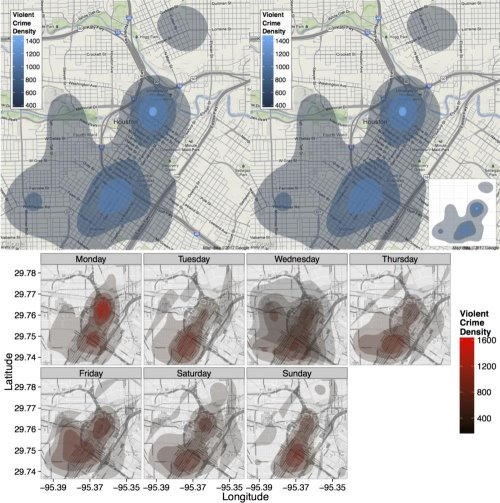</center>

*** =right
<center>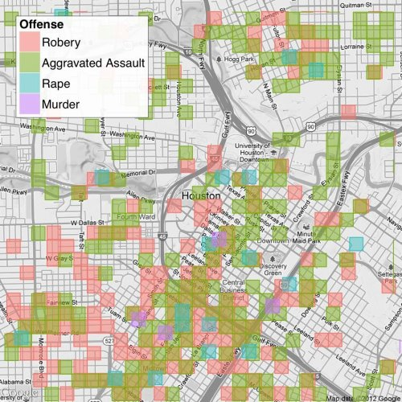</center>


--- &twocol w1:42% w2:54% .new-background
## CrimeMap - Maybe I can try it with different data?

*** =left

<h9>Is there any?</h9>
<center>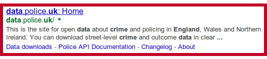</center>

<h9>Open Data and API!</h9>

Download crime data within a 1 mile radius of a single point (JSON)
```
http://data.police.uk/api/
       crimes-street/all-crime?
      lat=52.629729&
      lng=-1.131592&
      date=2012-04
```


*** =right
<h9>Raw Data in JSON format</h9>
```
{"category" : "anti-social-behaviour", 
 "month"    : "2012-04", 
 "location" : {
  "latitude"  : "52.640374", 
  "longitude" : "-1.122319",
  "street"    : {
   "id"   : 884330, 
   "name" : "On or near Christow Street"}}, 
  ... and some other stuff}
```

<h4><br></h4>
<h9>Improvement since then</h9>

Specific area (JSON) and batch download (CSV).


--- .dark .segue .nobackground
## Putting it together!


--- &twocol w1:48% w2:48% .new-background
## First Milestone: A Wrapper Function (June 2013)

*** =left

```{r wrapper, eval=FALSE, tidy=FALSE}
crimeplot.wrapper <- function(
  
    ## user-defined location
    point.of.interest = "London Eye", 
    
    ## period of time in YYYY-MM
    period = c("2013-01","2013-02",
               "2013-03","2013-04"),
    
    ## terrain, satellite, hybrid
    type.map          = "roadmap",
    
    ## month, category, type
    type.facet        = NA
    
    ...)   
```

*** =right
<center>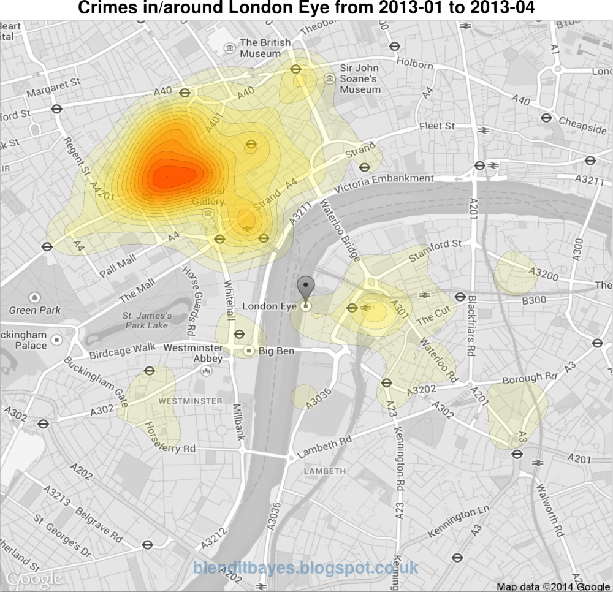</center>


--- &twocol w1:48% w2:48% .new-background
## CrimeMap - Application Examples (Map Type)

*** =left
<center>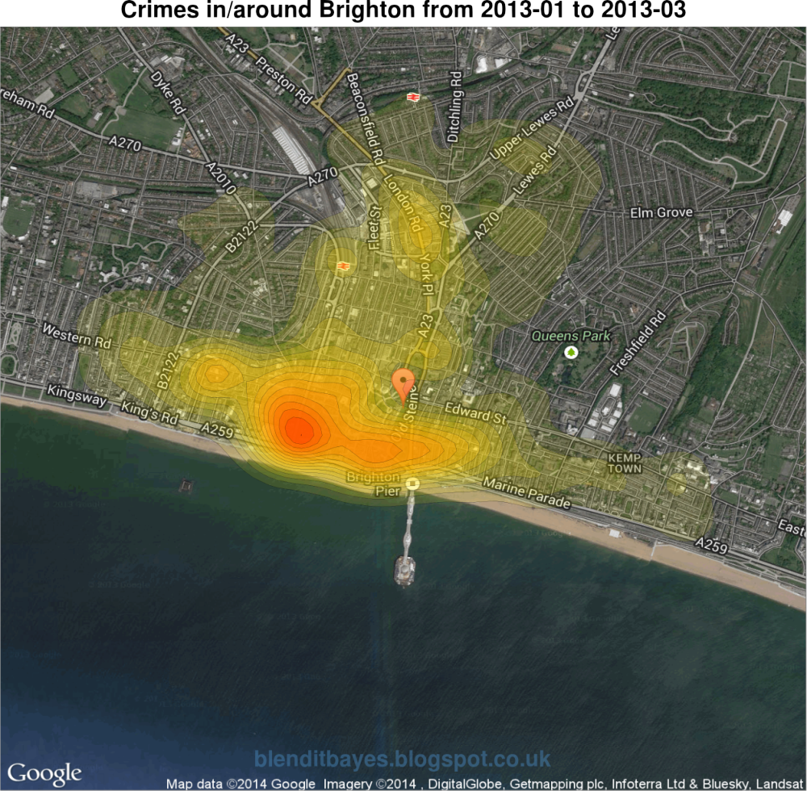</center>
<center><h3>Brighton (Map: Hybrid)</h3></center>

*** =right
<center>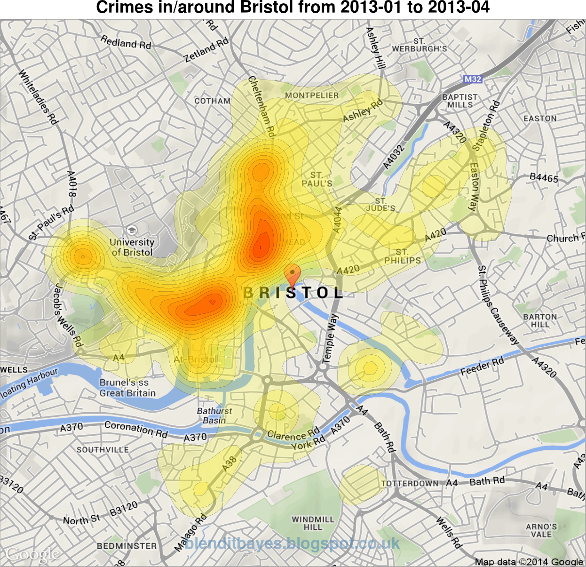</center>
<center><h3>Bristol (Map: Terrain)</h3></center>


--- &twocol w1:48% w2:48% .new-background
## CrimeMap - Application Examples (Facet)

*** =left
<h4><br></h4>
<center>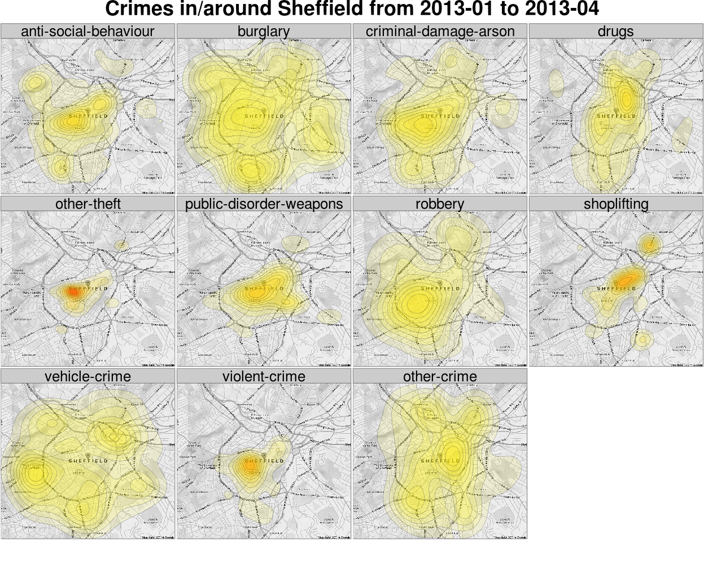</center>
<center><h3>Sheffield (by Category)</h3></center>


*** =right
<h4><br></h4>
<center>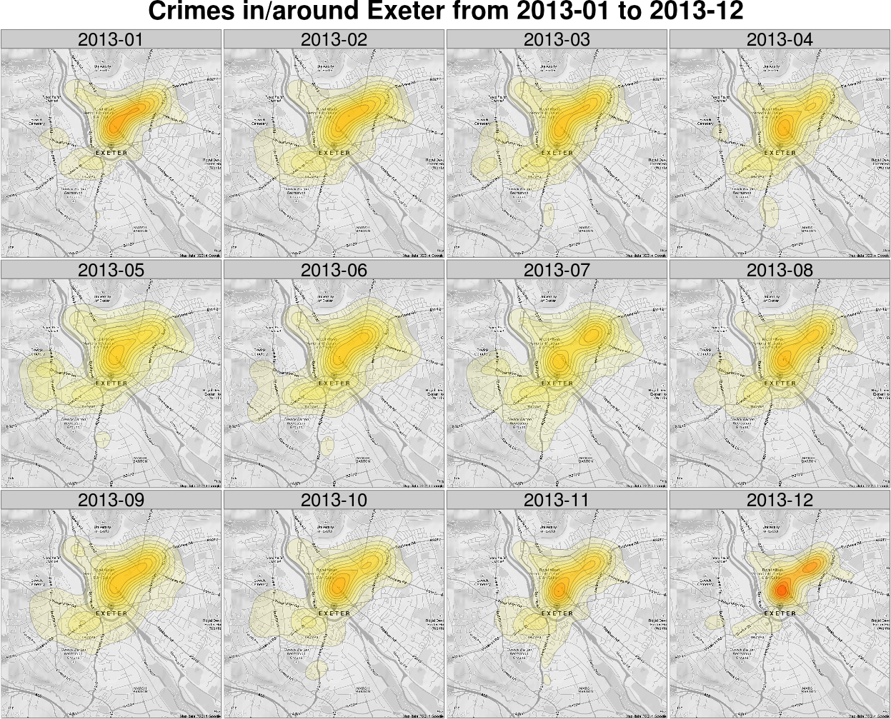</center>
<center><h3>Exeter (by Month) </h3></center>


--- .dark .segue .nobackground
## Making it Shiny!


--- &twocol w1:48% w2:48% .new-background
## CrimeMap - Making it Shiny!

*** =left
<h4><br></h4>
<center><h9>Shiny</h9></center>

"Shiny makes it super simple for R users like you to turn analyses into interactive web applications that anyone can use." - RStudio
<h4><br></h4>
<center><h9>ShinyApps Server</h9></center>

"ShinyApps is a platform as a service (PaaS) for hosting Shiny applications ... allowing you to create your online account, and deploy your first Shiny application to the cloud." - RStudio

*** =right
<h4><br></h4>
<center><h9>Motivation</h9></center>

"It looks fun! Maybe I can learn a new trick!"

<h4><br></h4>
<center><h9>Challenges</h9></center>

"Can I make it super user-friendly ... so easy that even my mom knows how to use it?"

"Is it really possible? I have <b>NO prior web app development experience</b> at all."

"Will it work on mobile devices?"


--- .new-background
## Second Milestone: Shiny Web App (Nov 2013) 

<h4><br></h4>

<h8>Controls, Data Table, Heat Map & Trends</h8>

<center>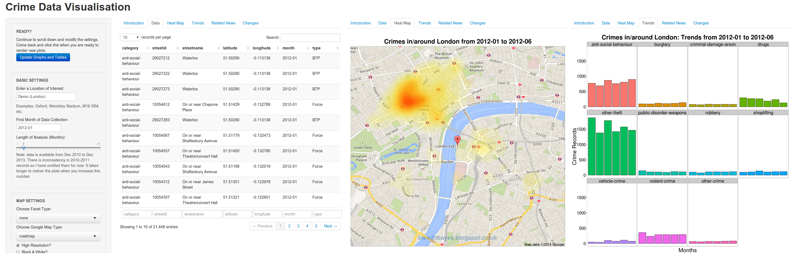</center>

<center><h3>[bit.ly/bib_crimemap](http://bit.ly/bib_crimemap)</h3></center>


--- &twocol w1:48% w2:48% .new-background
## CrimeMap - Keep It Simple, Stupid

*** =left
<center><h9>Basic Controls</h9></center>

<center>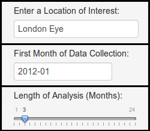</center>

<center><h9>Push the Button!</h9></center>

<center></center>


*** =right
<center><h9>Output</h9></center>
<center>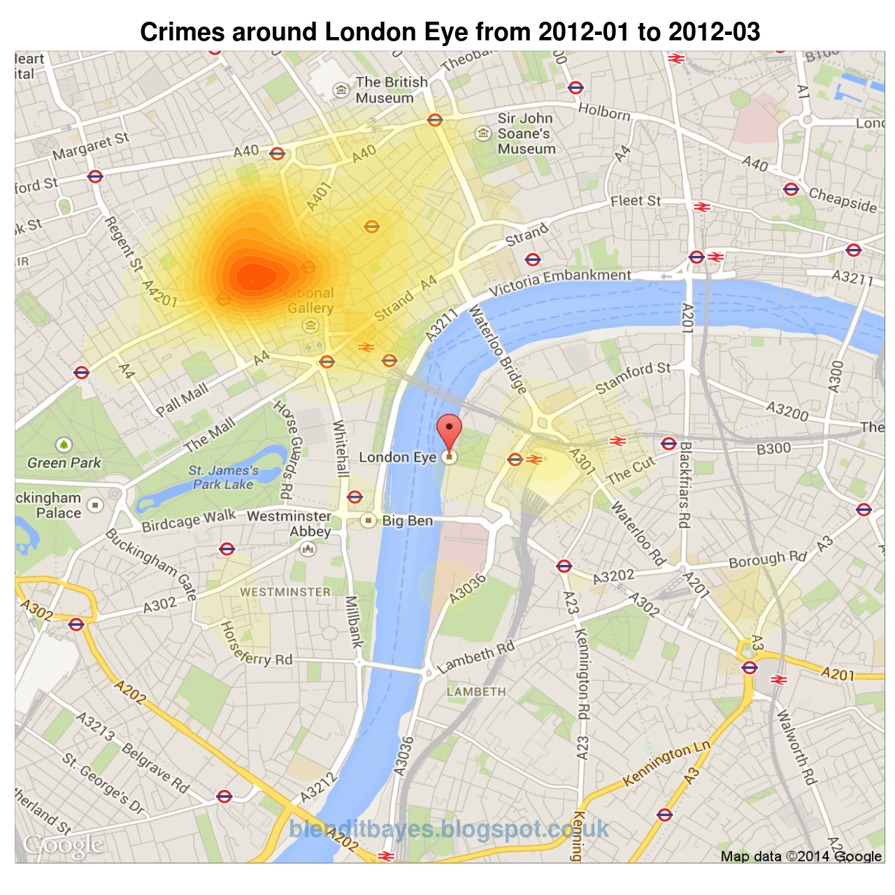</center>


--- &twocol w1:48% w2:48% .new-background
## CrimeMap - Control Freak !!!

*** =left
<center><h9>More Controls</h9></center>
<center>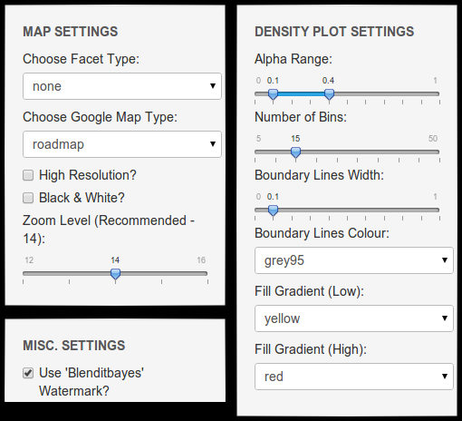</center>

*** =right
<center><h9>What's Your Favourite?</h9></center>
<center>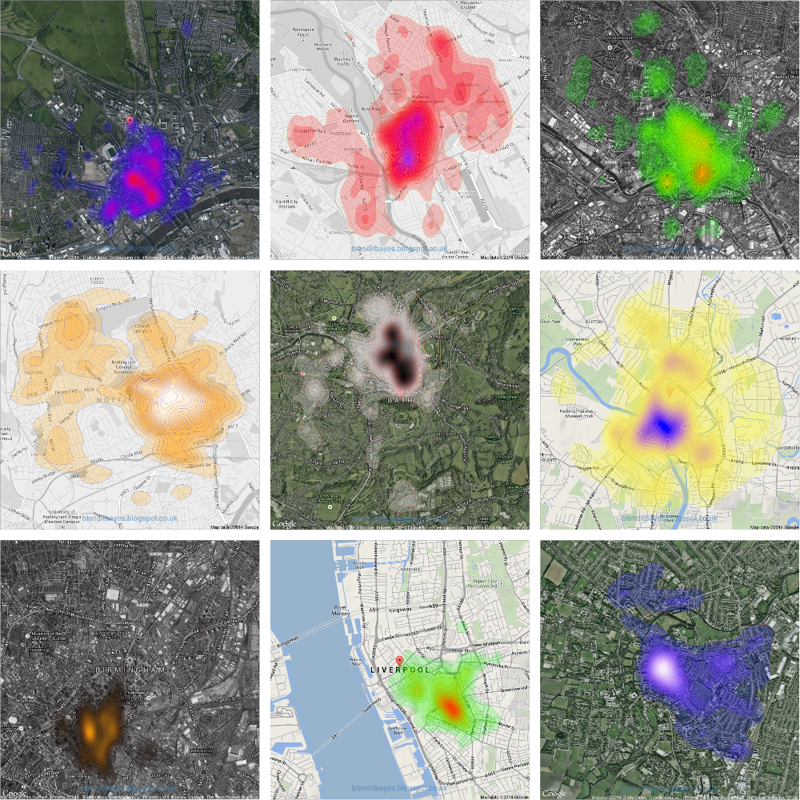</center>


--- .dark .segue .nobackground
## Sharing it with the world!


--- &twocol w1:50% w2:46% .new-background
## CrimeMap - Hosting it with ShinyApps

*** =left  
###  Set Credentials

```{r, eval=FALSE, tidy=FALSE}
setAccountInfo(name   = "blenditbayes", 
               token  = "your_token", 
               secret = "your_secret") 
```

### Deploy it!

```{r, eval=FALSE, tidy=FALSE}
deployApp(appDir  = "your_app_dir",
          appName = "your_app_name")
```

### Configure Instance Type

```{r, eval=FALSE, tidy=FALSE}
configureApp(appName = "crimemap", 
             size    = "xlarge") 
```

*** =right
### Available Options

Instance | Memory Size
---------|----------
small (default) | 256 MB
medium  | 512 MB
large   | 1024 MB
xlarge  | 2048 MB
xxlarge | 4096 MB

<h4><br></h4>
### For More Information
1. ShinyApps (Hassle-free Cloud Hosting) [Link](http://www.shinyapps.io/signup.html)
2. Shiny Server (Host Your Own) - Free and Professional Version [Link](http://www.rstudio.com/shiny/server/)


--- &twocol w1:48% w2:48% .new-background
## CrimeMap - Using it on iPhone 4s & Nexus 7

*** =left
<center>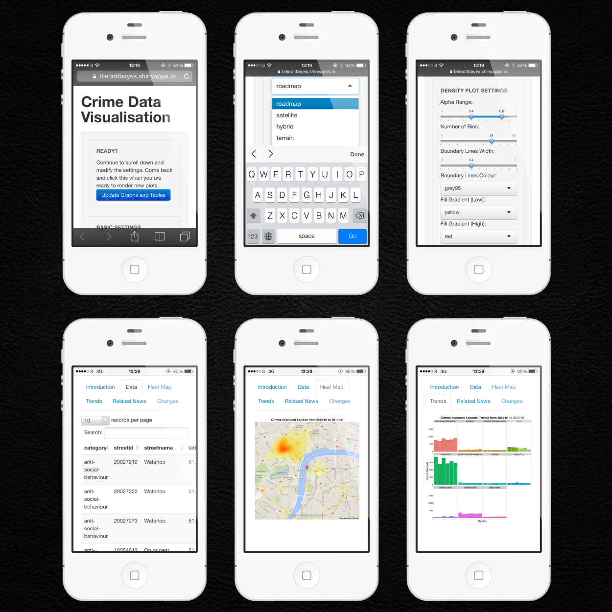</center>

*** =right
<center>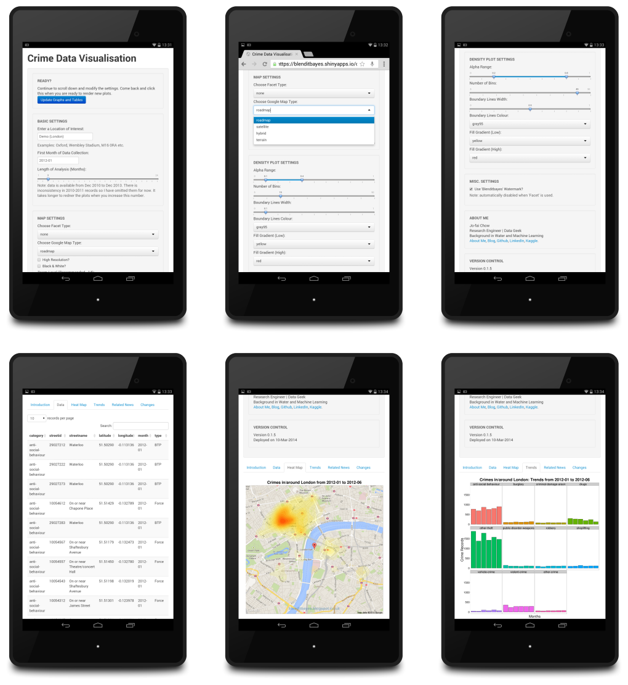</center>


--- &twocol w1:48% w2:48% .new-background
## CrimeMap - Forked Projects

*** =left
<center><h9>Codes on GitHub</h9></center>
<center>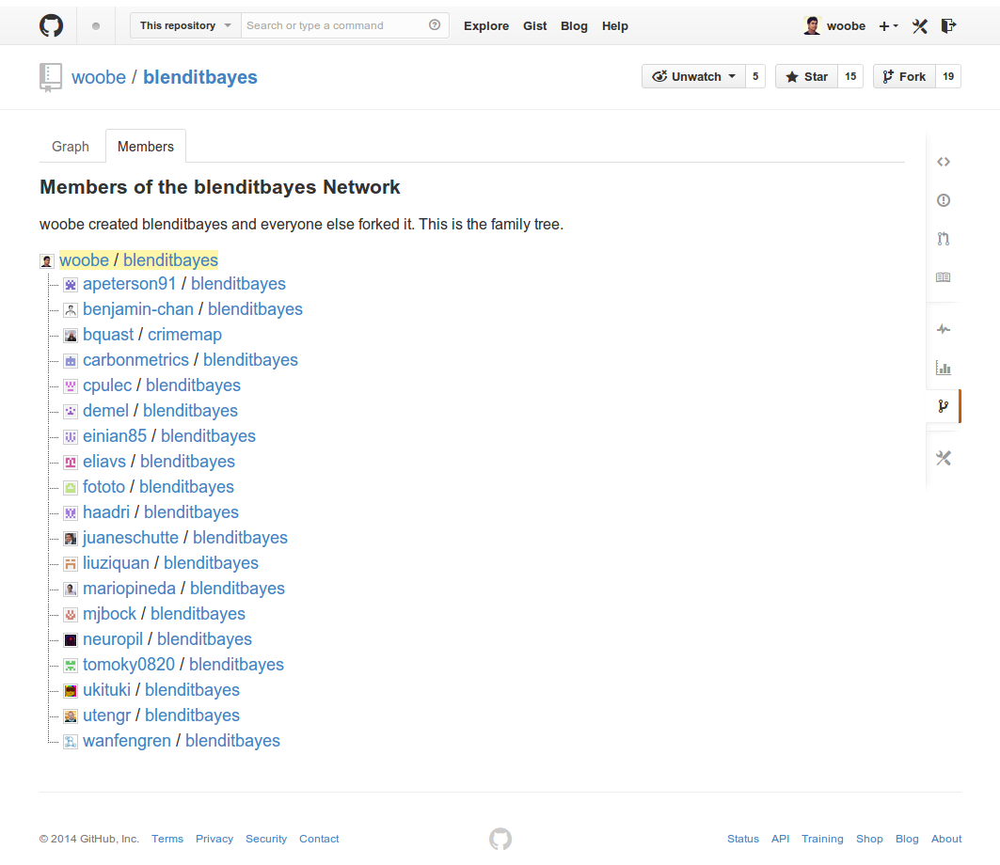</center>
<center><h3>[bit.ly/github_woobe](http://bit.ly/github_woobe)</h3><center>

*** =right
<center><h9>Jonathan Sidi (Israel)</h9></center>
<center>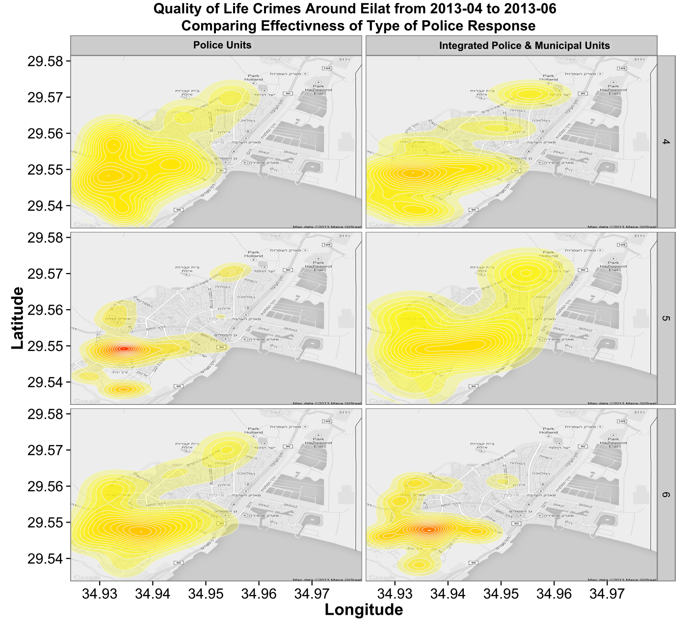</center>


--- .dark .segue .nobackground
## Summary of Experience


--- &twocol w1:48% w2:48% .new-background
## CrimeMap - Summary of My Shiny Experience

*** =left
<h4><br></h4>
<center><h9>Developing with Shiny</h9></center>

1. Rapid development - from noob to my first web app in a few days!
2. Default layout is nice and simple. You can further customise it with CSS.
3. It works on mobile devices!
4. Easy code sharing.
5. Even my mom knows how to use it!!!


*** =right
<h4><br></h4>
<center><h9>Hosting with ShinyApps</h9></center>

1. Hassle-free. No need to worry about maintenance and data usage.
2. Deploy (or update) your app in minutes.
3. Great support from the RStudio team!


--- .dark .segue .nobackground
## What's Next?


--- &twocol w1:48% w2:48% .new-background
## Discovering Cool Stuff from Ramnath Vaidyanathan

*** =left
<center><h9>You've probably seen ...</h9></center>
<center>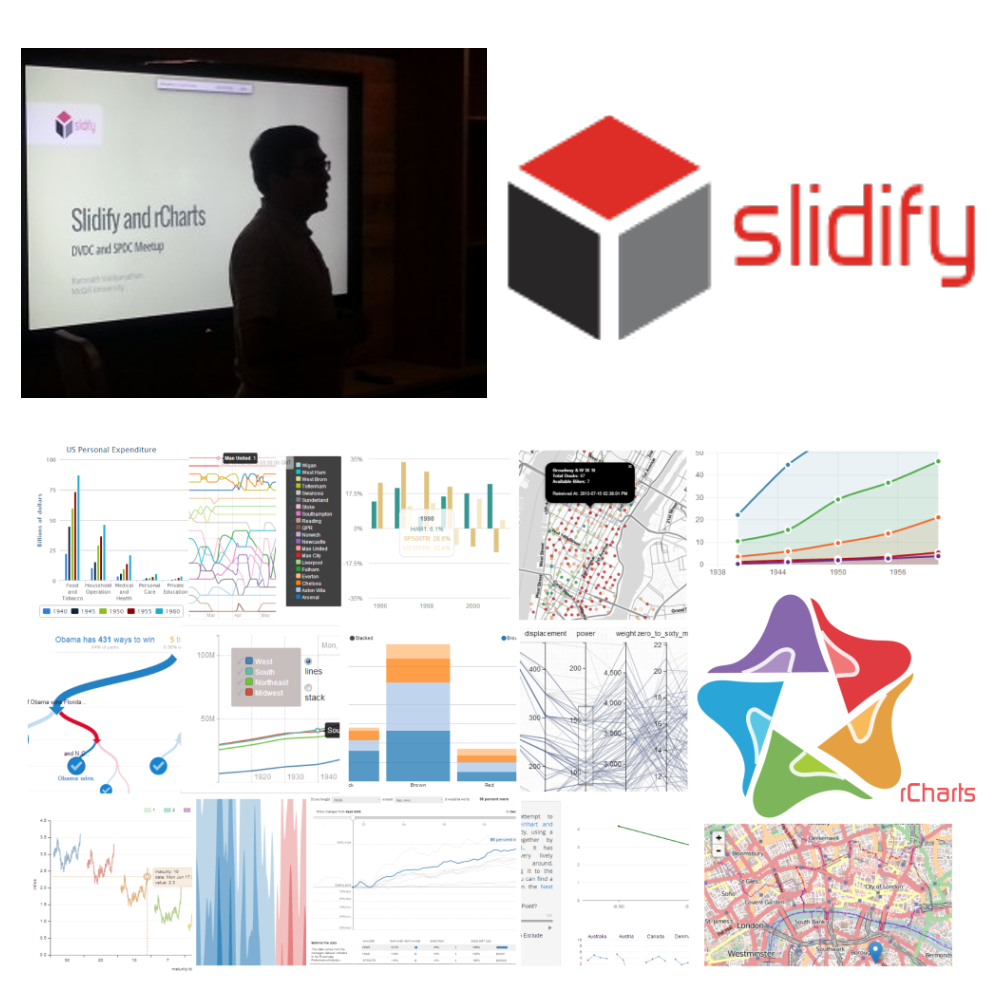</center>

*** =right
<center><h9>... and now 'rMaps' !</h9></center>
<center>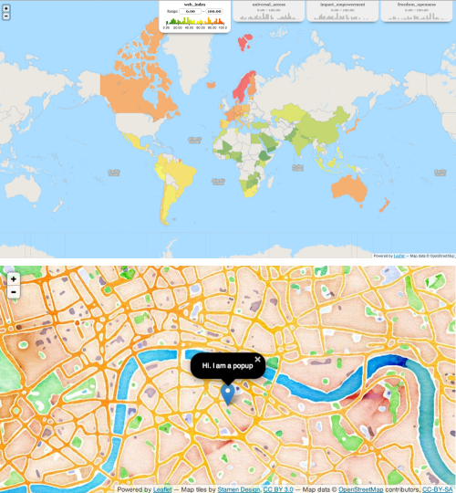</center>


--- .dark .segue .nobackground
## What if ... rMaps + CrimeMap?


--- &twocol w1:48% w2:48% .new-background
## Introducing Package 'rCrimemap'

*** =left

<h8>Prerequisites</h8>
```{r, eval=FALSE, tidy=FALSE}
require(devtools)
install.packages(c("ggmap", "rjson",
                   "dplyr"))
install_github('ramnathv/rCharts@dev')
install_github('ramnathv/rMaps')
```
<h3>Latest RStudio IDE (v0.98.501+)</h3>

<h4><br></h4>
<h8>Install 'rCrimemap'</h8>

```{r, eval=FALSE, tidy=FALSE}
install_github('woobe/rCrimemap')
```

*** =right
<h8>Function 'rcmap()'</h8>
```{r, eval=FALSE, tidy=FALSE}
rcmap(
  location = "Ball Brothers EC3R 7PP", 
  period = "2014-01",
  type = "All",
  map_size = c(1000, 500), 
  provider = "Nokia.normalDay",
  zoom = 10)
```

<h4><br></h4>
<h8>Codes</h8>
<h8>[bit.ly/rCrimemap](http://bit.ly/rCrimemap)</h8>


--- .new-background
## Introducing Package 'rCrimemap' - LondonR Demo

```{r, eval=FALSE, tidy=FALSE}
require(rCrimemap); rcmap("Ball Brothers EC3R 7PP");

# [rCrimemap]: Downloading '2010-12.rda' from author's Bitbucket account ...
# [rCrimemap]: Converting raw data into JSON format for Leaflet ...
# [rCrimemap]: Creating Leaflet with Heat Map ...
 
# [rCrimemap]: =======================================================
# [rCrimemap]: Summary of Crime Data Used and Leaflet Map
# [rCrimemap]: =======================================================

# Point of Interest           : Ball Brothers EC3R 7PP 
# Police Force(s)             : Metropolitan Police Service City of London Police 
# Period of Crime Records     : 2010-12 
# Type of Crime Records       : All 
# Total No. of Crime Records  : 93077 
# Map Resolution              : 1000 x 500 
```


--- &twocol w1:48% w2:48% .new-background
## Introducing Package 'rCrimemap' - LondonR Demo

*** =left 
```{r, eval=FALSE, tidy=FALSE}
rcmap("Ball Brothers EC3R 7PP", 
      "2011-08", "All", c(1000,1000),
      "Nokia.normalDay")
```
<center></center>


*** =right
```{r, eval=FALSE, tidy=FALSE}
rcmap("Manchester", 
      "2014-01", "All", c(1000,1000), 
      "MapQuestOpen.OSM")
```
<center>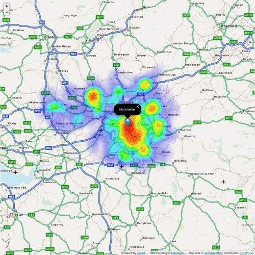</center>


--- .dark .segue .nobackground
## Beyond Data Points and Fancy Graphs


--- &twocol w1:48% w2:48% .new-background
## Related BBC Articles

*** =left
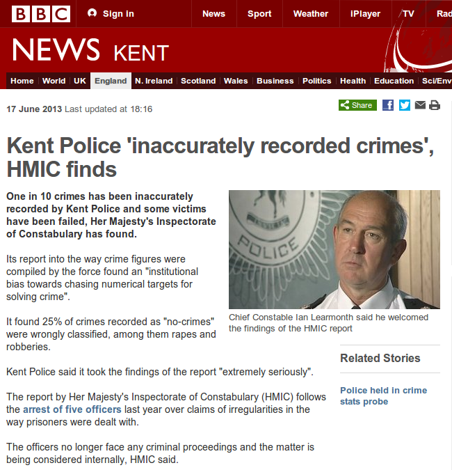
<center>[BBC (17-Jun-2013)](http://www.bbc.co.uk/news/uk-england-kent-22940563)</h1></center>

*** =right

<center>[BBC (19-Nov-2013)](http://www.bbc.co.uk/news/uk-25002927)</h1></center>


--- &twocol w1:70% w2:30% .new-background

*** =left

## Beyond Exploratory Analysis
<h4><br></h4>
* <h8>Can we trust the data?</h8>
* <h8>Can we improve the data?</h8>
* <h8>Can we learn from the data?</h8>
* <h8>Can we predict crime rate?</h8>
* <h8>Can we optimise the resources?</h8>
* <h8>Can we build a new decision support system?</h8>


--- .dark .segue .nobackground
## Conclusions


--- .new-background
## Conclusions

* <h9>Reasons why I shifted to R</h9>
  * <h8>R is excellent for data mining, visualisation, big data, dynamic doc etc.</h8>
* <h9>CrimeMap</h9>
  * <h8>a wonderful learning experience.</h8>
  * <h8>a case study for Shiny and ShinyApps.</h8>
* <h9>Things keep evolving</h9>
  * <h8>rMaps + CrimeMap = rCrimemap</h8>


--- &twocol w1:68% w2:29% .new-background
## Want to Find Out More About Shiny?

*** =left
<h4><br></h4>
<h3><b>RStudio's</b>
<a href="http://www.rstudio.com/shiny/" target="_blank">Intro</a>, 
<a href="http://rstudio.github.io/shiny/tutorial/" target="_blank">Tutorial</a>, 
<a href="http://www.rstudio.com/shiny/showcase/" target="_blank">Showcase</a> and 
<a href="http://www.shinyapps.io/" target="_blank">ShinyApps</a>.</h3>

<h4><br></h4>
<h3><b>Chris Beeley's</b>
<a href="http://chrisbeeley.net/website/shinytalk/TalkPage.html" target="_blank">LondonR Presentation (Dec 2013)</a> and 
<a href="http://bit.ly/1dv2VDS" target="_blank">His Book.</a></h3>
<h3><b>Another three copies for LondonR members!! </b><h3>
<h8>Check out my <a href="http://bit.ly/blenditbayes" target="_blank">blog</a> at 9pm GMT+0 tomorrow!</h8>

<h4><br></h4>
<h3><b>Show Me Shiny - </b><a href="http://www.showmeshiny.com/" target="_blank">Gallery of R Web Apps </a>
</h3>


*** =right
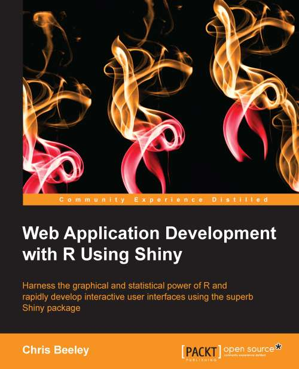
  
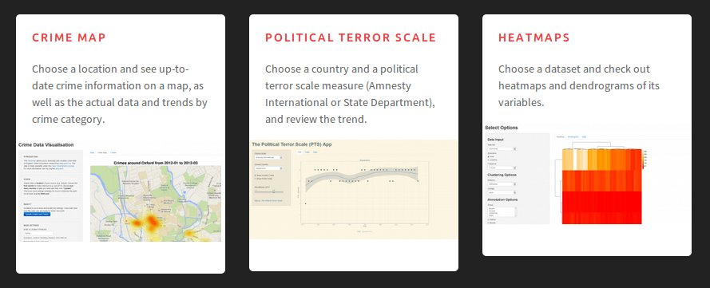


--- .new-background
## John M. Chambers on R
<h4><br><br></h4>
<h8>"R has had a revolutionary effect on the way statistics are communicated ..."</h8>
<h4><br><br></h4>
<h8>"... for many things now, people produce the code, they produce an R package, an instantly, everyone else can use what they've got freely and contribute their ideas to let things evolve."</h8>


--- &twocol w1:48% w2:48% .new-background
## F.Y.I.

*** =left

<center><h2>Effective Applications of the R Language Conference 2014</h2></center>
<center><h3>http://www.earl-conference.com/</h3></center>
  
*** =right
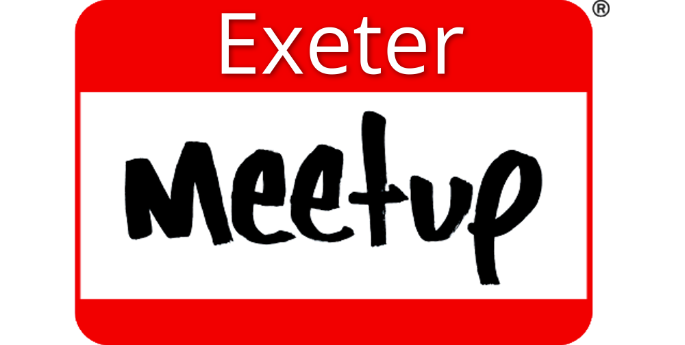
<center><h2>Exeter R Users Group</h2></center>
<center><h3>http://bit.ly/rug_exeter/</h3></center>


--- .new-background
## Acknowledgement

Thanks       | For
-----------|-----------
<h3>Coursera & Jeff Leek</h3>    | <h3>Data Analysis Online Course<h3>
<h3>David Kahle & Hadley Wickham</h3>   | <h3>ggmap and ggplot2</h3>
<h3> data.police.uk</h3> | <h3>Open Crime Data and API</h3>
<h3>RStudio Team (esp. Tareef Kawaf)</h3>     | <h3>RStudio IDE, Shiny & ShinyApps</h3>
<h3>Chris Beeley & Packt</h3>    | <h3>For the Shiny Cookbook</h3>
<h3>Ramnath Vaidyanathan</h3>    | <h3>Slidify, rCharts and rMaps</h3>
<h1>... and, most importantly, of course ...</h1><h2>Mango Solutions</h2> | <h1>... kindly sponsoring and supporting</h1><h2>LondonR since 2009!</h2>


--- &twocol w1:48% w2:48% .new-background
## Thank You for Your Attention!

*** =left
<h1>You can find the slides at </h1><h2>bit.ly/londonr_crimemap</h2>

Other Stuff | URL
-----------|-----------
<h3>CrimeMap</h3> | <h3><a href="http://bit.ly/bib_crimemap" target="_blank">bit.ly/bib_crimemap</a></h3>
CrimeMap Codes on GitHub | <h3><a href="http://bit.ly/github_crimemap" target="_blank">bit.ly/github_crimemap</a></h3>
<h3>rCrimemap</h3> | <h3><a href="http://bit.ly/rCrimemap" target="_blank">bit.ly/rCrimemap</a></h3>
<h3>GitHub</h3>    | <h3><a href="http://bit.ly/github_woobe" target="_blank">bit.ly/github_woobe</a></h3>


*** =right
<h1>For more information</h1><h2>Contact Me</h2>

Via       | URL
-----------|-----------
<h3>Blog</h3>      | <h3><a href="http://bit.ly/blenditbayes" target="_blank">bit.ly/blenditbayes</a></h3>
<h3>Twitter</h3>   | <h3><a href="http://bit.ly/twitter_woobe" target="_blank">@matlabulous</a></h3>
<h3>E-mail</h3>    | <h3>jofai.chow@gmail.com</h3>
<h3>LinkedIn</h3>  | <h3><a href="http://bit.ly/linkedin_jofaichow" target="_blank">bit.ly/linkedin_jofaichow</a></h3>
<h3>AboutMe</h3>  | <h3><a href="http://bit.ly/aboutme_jofaichow" target="_blank">bit.ly/aboutme_jofaichow</a></h3>


